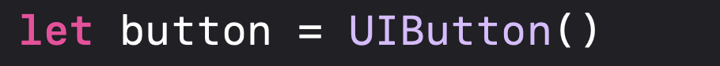
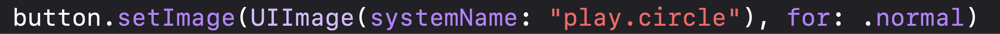
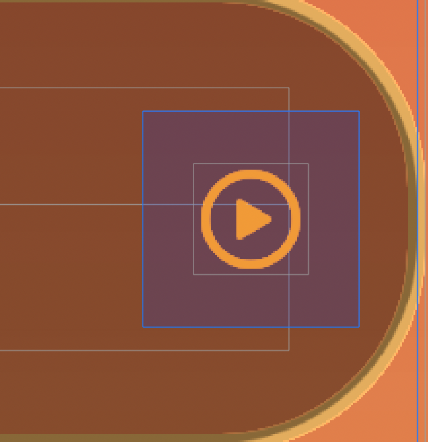
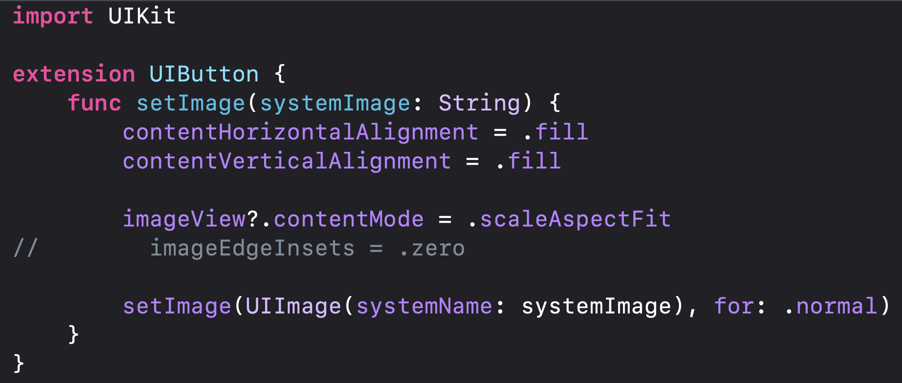
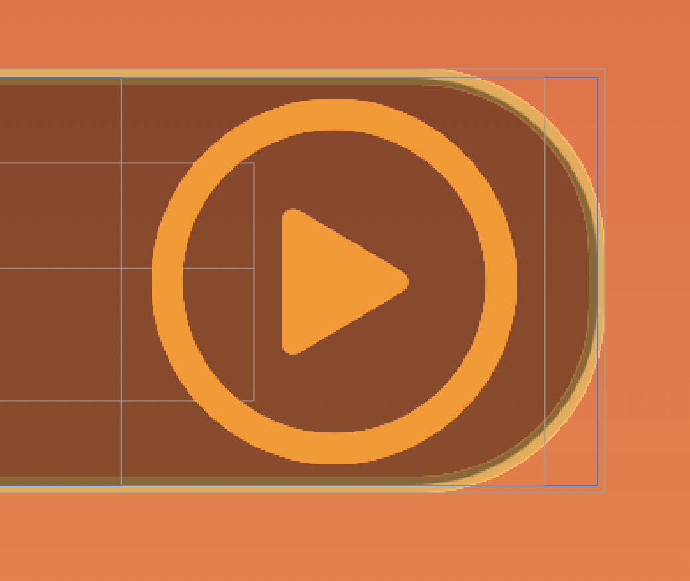
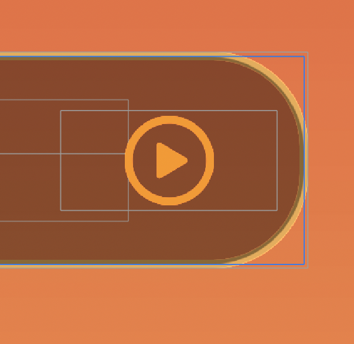

UIButton의 이미지를 사이즈를 크게  할수있을까요?
---

오늘도 어김없이 모르는 문제거리들이 나왔네요. ㅎㅎ 

저는 오늘 snapKit을 사용해 제가 좋아하는 UI를 구현해 보고있었는데요! 

도중에 정말 간단하지만 어질어질한 문제를 마주하고 해결한 UIButton에 대해 말씀올리겠습니다~  (일단 모두 형누나들이라고 생각하겠습니다..)

자.. 우선  버튼을 하나 만들고

 

setImage를 이용해 버튼의 이미지를 세팅해주었습니다.

하지만 제가 원하는 레이아웃과 크기가 나오지 않았네요 ㅠㅠ.

​         

버튼의 높이와 폭을 똑같게 정해주었는데도 크기가 조그만하게 있는걸 볼수있습니다.

스토리보드였다면 pointsize를 조정해 이미지를 키울수있겠지만 코드로는 어떻게하는지 찾지 못했습니다.. 방법을 아시면 알려주세요,, 

일단 저는 인터넷을 찾아보다가  extenstion으로 UIButton자체를 fill 만들어 폭과 넓이 만큼 그냥 커다라게 보여줄수있는 코드를 발견했습니다.

이 간단한 코드인데요! 콘텐츠의 수직,수평의 정렬을 .fill로 설정해주고 

image로 받은 콘텐츠의 모드는 .scaleAspectFit으로 설정해주고있습니다.

setImage의 UIImage(systamName: 매개변수, for: ,normal )  이런식인데요 매개변수로 설정된값을 받아서 쓰도록 되어있네요.

쉽습니다. 아주 좋아요..

주석처리되있는 부분은 ios15.0부터는 사용할 필요가없는 코드라고하네요. 이코드는 UIButtonConfiguration을 만들때 무시하게된다고 하네요. 

이제 UIButton을 확장을 했으니 커다란 버튼에 폭과 넓이만 정해주면 원하는 버튼이 만들어진다는거죠!

이렇게 확장해준 버튼을 바로 사용해줍니다. 

이렇게까지하면..

      

요로케! 알아서 거대해진걸 볼수있습니다.  흠.. 근데 제가원하는 크기가 아닌거 같으니 제가원하는 높이와폭을 다시 줘보겠습니다.  

 

네. 제가 원하는 레이아웃이 적용되었네요.  

이렇게 간결하고 좋은 코드를 보면 볼수록 코딩의 새로움과 흥미로움이 계속 생기네요. 하하 다들 이방법 보다 더좋은 방법이 있을수도 있겠지만 

저는 또한번 동굴에서 처음 발견한 광석처럼 새로운 코드를 보고 정말 좋아했습니다..ㅎ  더욱 열심히 하도록 노력하겠습니다. 

 다들 빡코딩 하세요~

